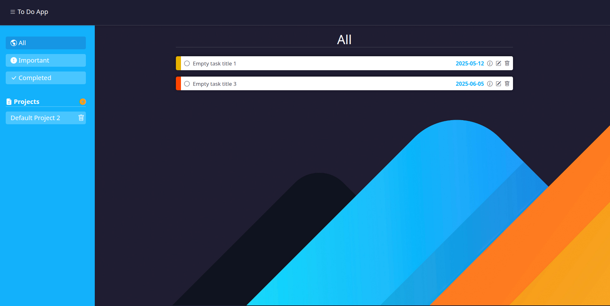

# 📋 To-Do List App

A dynamic and responsive to-do list web application built with vanilla JavaScript, HTML, and CSS. This app allows users to manage tasks across multiple projects with features like due dates, priorities, modals, and a clean UI — all bundled using **Webpack**.

---

## 🚀 Features

- 🗂️ Project-based task organization
- 📝 Create, edit, and delete tasks
- 📌 Set priority levels (High, Medium, Low)
- ✅ Mark tasks as completed
- 🔍 View important or completed tasks
- 🧹 Smooth sidebar toggle and responsive design
- 💾 Tasks and projects persist using `localStorage`
- 📦 Built and optimized with **Webpack**

---

## 🧰 Technologies Used

- HTML5
- CSS3
- JavaScript (ES6+)
- Bootstrap 5
- Bootstrap Icons
- Webpack

---

## 📷 Screenshot



---

## 🛠️ Setup & Run Instructions

1. **Clone this repository**
   ```bash
   git clone https://github.com/SantosNovoa/todo-list.git
   cd todo-app

2. **Install dependencies**
   npm install

3. **Run the dev server**
   npm start

4. **Build the project**
   npm run build
